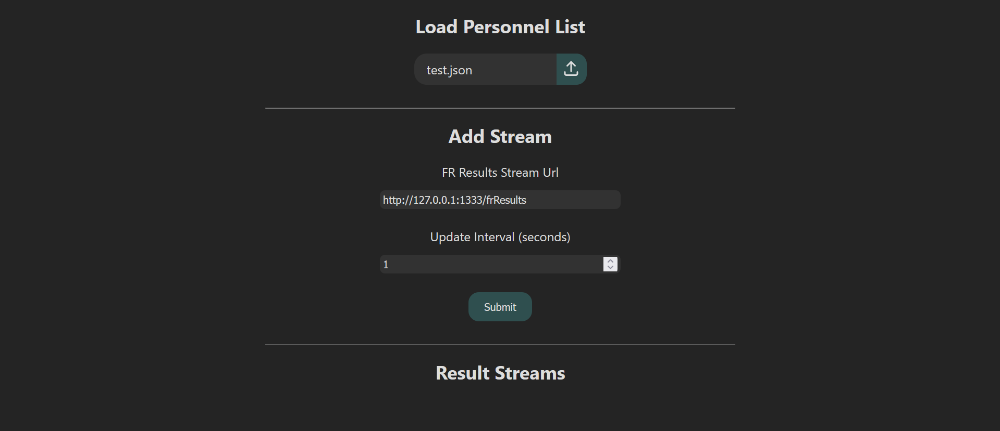
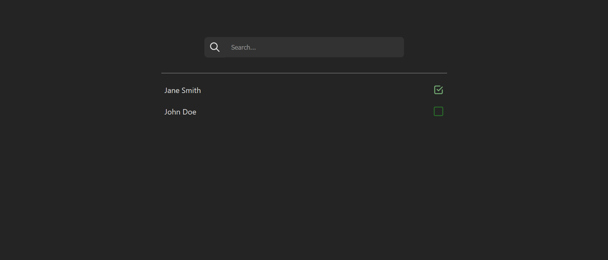

# Gotendance


---

## Table of Contents

- [Description](#description)
- [Features](#features)
- [Installation](#installation)
- [Usage](#usage)

---

## Description

**Gotendance** is an attendance tracking app to accompany [**simpliFRy**](../simpliFRy/). They can be used together for facial recognition attendance taking. Gotendance is built primarily from the <ins>Go</ins> programming language, and its Web UI is made from <ins>HTML/CSS/JS</ins>. This enables it to be lightweight and easy to deploy. 

---

## Features

### Easy Installation and Deployment

Golang programs are able to be compiled to a binary executable while vanilla javascript allows the UI to be run by any browser without a need for a JavaScript runtime module such as NodeJS. Once the executable is built, this app can be easily distributed by copying the binary `.exe` file and the `templates` and `static` folders.

### Concise Design

Gotendance did not include many of the features present in [the previous attendance app](https://github.com/CJBuzz/FRS), and is designed to be as simple and lightweight as possible. This is because many of those features were mostly unused. Furthermore, although the previous app tried to be as versatile as possible by anticipating what users might want, additional features not present in that app were often requested. Almost all of those requested features were only used for that one specific use case. Therefore, it felt prudent to disregard the attempt at having a 'one-size-fit-all' app and instead adopt a concise design, while providing ways to build other services off this app (and simpliFRy) in a microservice architecture. 

---

## Installation

### Prerequisites

- [Golang](https://go.dev/doc/install)

### Installation via Docker

1. Clone the repository:

   ```bash
   git clone https://github.com/CJBuzz/Real-time-FRS-2.0.git
   ```

2. Navigate to gotendance directory

   ```bash
   cd gotendance
   ```

3. Build Executable
   ```bash
   go build
   ```

A executable file `gotendance.exe` will be produced. You can copy this file, together with the `static` and `templates` folders into other directories and computers and run the gotendance app without any issue. Just ensure that `gotendance.exe`, `static` and `templates` are in the same directory. 

```
folder/
├── static/
├── templates/
└── gotendance.exe
```

## Usage

### Starting the Application

Click on `gotendance.exe` to run the app.

Access the web UI at <http://127.0.0.1:1500> (preferably using Microsoft Edge)

### Using with simpliFRy



1. Load the JSON file prepared for simpliFRy into *Load Personnel List* file input and click the upload icon. [Here](../simpliFRy/ReadME.md#data-preparation) is more information on preparation of this file. A sample JSON file in `assets/test.json` has been provided. 

2. Enter the simpliFRy results stream url into the *FR Results Stream URL* input and submit (have to ensure simpliFRy is running).

  - **FR Results Stream URL** (string): results stream from simpliFRy, the endpoint is `/frResults`. IP and port depends on where simpliFRy is ran. The results stream is a HTTP Streaming Response, of [this format](../simpliFRy/Developer%20Guide.md#4-access-fr-results).
  - **Update Interval** (float): number of seconds between each update of gotendance's internal records. This is to reduce unnecessary computations (so gotendance does not keep going through the results continuously, especially when much of it is repeated). However, it is ideal that this number is less than [**Holding Time**](../simpliFRy/Developer%20Guide.md#holding-time) as some detections may be missed otherwise.

Multiple results stream can be added. Gotendance will listen to all of them concurrently.

3. The URL of the successfully added stream will be displayed under *Results Stream* below. You can remove any results stream and gotendance will stop listening to that results.

4. Access the attendance records page on <http://127.0.0.1:1500/records>.



Names with a checkmark beside it means they have been detected by simpliFRy.

You can manually mark an individual as 'Present' or 'Absent' by clicking on the checkbox icon.

To reset the attendance, repeat *Step 1*.
